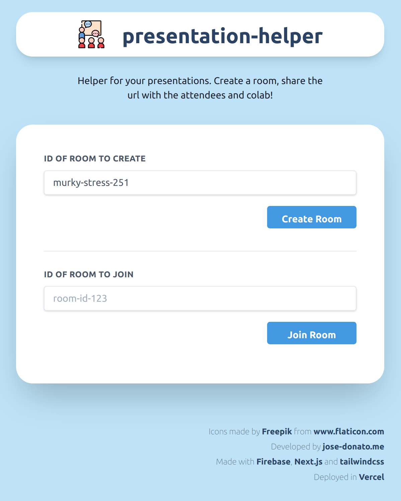
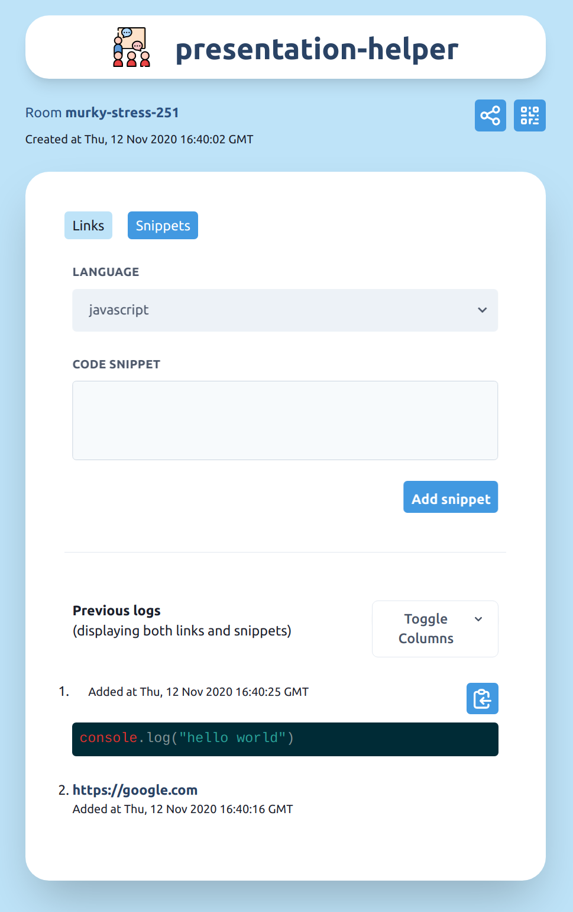

  <h3 align="center"><a href="https://presentation-helper.vercel.app">presentation-helper.vercel.app</a></h3>
<h3 align="center">
  
</h3>

<p align="center">
  <a href="https://github.com/sponsors/jose-donato"></a>
  <a href="https://www.buymeacoffee.com/josedonato"></a>
</p>


<p align="center">
  <a href="https://presentation-helper.vercel.app">presentation-helper</a> - a small tool to help you and your attendees ace in presentations. Create a room and share it in seconds. Then you can share snippets and links that the attendees can see immediately.
</p>

<br />


### Features
* **Simple** 💡 - create room and share content in seconds
* **Fast** 🚀 - Static + realtime updates with [Cloud Firestore](https://firebase.google.com/docs/firestore)
* **Scalable** 🌍 - [Next.js ISG](https://nextjs.org/docs/basic-features/data-fetching#incremental-static-regeneration) combined with [Cloud Firestore](https://firebase.google.com/docs/firestore) allows us to create new URL for the rooms on the fly
* **Modern** 🛸 - built using fresh frameworks
* **Installable** 📱 - the web application is installable as a PWA offering a similar to native experience in all devices
* **Offline** 😴 - with service workers, if the user is offline we display a static page offline page

#### Upcoming features
*  

### Technologies used
* made with [Next.js](https://presentation-helper.vercel.app) 
* persistent data (rooms and its content) in [Cloud Firestore](https://firebase.google.com/docs/firestore) 
* styling with [tailwindcss](https://tailwindcss.com/) 
* icons from [Flaticon](https://www.flaticon.com/) 
* deployed in [Vercel](http://vercel.com/) 

### Run in development mode
What you need:
* **backend**: create a firebase account and project
  * create firebase project
  * create web application in firebase project
  * create cloud firestore in firebase project 
  * grab *apiKey*, *databaseURL* and *projectId* from firebase configuration object - [more info in firebase docs](https://firebase.google.com/docs/web/setup#node.js-apps)

* **frontend**: this repository
```sh
git clone https://github.com/jose-donato/presentation-helper
cd presentation-helper
npm i
touch .env.local
npm run dev
```

`.env.local` file should look similar to this but with the credentials you grab from firebase:
```
NEXT_PUBLIC_FIREBASE_API_KEY="XXX"
NEXT_PUBLIC_FIREBASE_AUTH_DOMAIN="YYY.firebaseapp.com"
NEXT_PUBLIC_FIREBASE_PROJECT_ID="YYY"
```

### App preview
> The application is live, you can try it [here](https://presentation-helper.vercel.app)


<br>

<br>


### Scores
> carbon - https://www.websitecarbon.com/website/presentation-helper-vercel-app/ 


<br>
> lighthouse - 


### Funding
I'm starting my career and at the same time finishing my masters' in Cyber Security. If I helped you in any way please consider to support me in [GitHub](https://github.com/sponsors/jose-donato) or [by buying me a coffee](https://www.buymeacoffee.com/josedonato).


### Contributing
Contributions are welcomed. Feel free to PR or open an issue with ideas/bugs found.


### License
This project is licensed under MIT. Feel free to use it where you need. However, consider to support me if my work has helped you.
